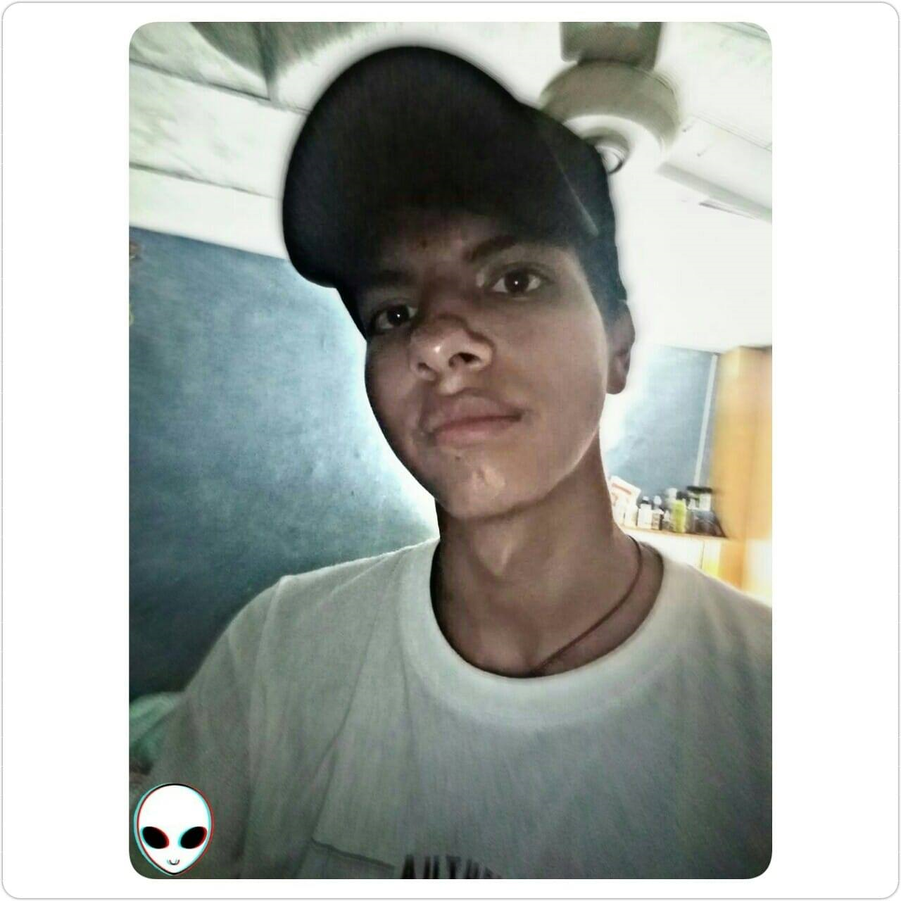

#  biografia   
# JOEL PLUAS
<html lang="en">
<head>
	<!-- Required meta tags -->
	<meta charset="utf-8">
	<meta name="viewport" content="width=device-width, initial-scale=1, shrink-to-fit=no">
	<!-- ************FAVICON************ -->
	<link rel="icon"   href="img/favicon.png" type="image/png">
	<!-- ************Estilo css Propio************ -->
	<link rel="stylesheet" type="text/css" href="css/estilo.css">
	<!-- Bootstrap CSS -->
	<link rel="stylesheet" type="text/css" href="css/bootstrap.min.css">
	<link rel="stylesheet" href="css/bootstrap.min.css">

	<!-- Estilo INTERNO -->
	
	<title>Personal-Sanchez</title>
	
</head>
<body background="/assets/portfolio.png" style="background-color: #AFBBA9;">

     
	

		

			

		

		

			
<h2>¿Quién soy yo? Autobiografía</h2>

		

		

			

				
Mi nombre es Joel Abraham Plúas Núñez, tengo 18 años, nací el 24 de febrero del 2001, en la ciudad de Guayaquil/Ecuador. Actualmente sigo viviendo aquí en la ciudad en que nací, me crie con mis abuelos Jacqueline Calderón Rodríguez y Marco Plúas Chancay. Ellos fueron lo que me criaron desde que mi mama y mi papa se separaron, desde muy pequeño mis abuelos me enseñaron buenos valores como respetar a las mujeres, a los mayores, dejar que opinen para después dar mi punto de vista, etc. Bueno a lo largo que crecía mis abuelos me metieron a estudiar a la edad de 4 o 3 años no recuerdo muy bien, estudie en la Unidad Educativa Venecia, sinceramente es muy buena escuela, pero como yo era relajos desde pequeño sacaba bajas notas y por eso muchas veces tenía problemas con mis padres(Abuelos). Quiero recalcar estudie con mi hermano y mis primos, si, mis abuelos nos criaron a los cuatro y a lo largo mis primos y mi hermano hemos tenido una muy buena comunicación. Volviendo al tema, cuando termine quinto año de escuela en la Venecia, mi mamá nos llevó a mí y a mi hermano a salinas, si, tanto mi mama como mi papa ya tenían pareja, bueno mi mama nos llevó a la provincia de Santa Elena donde tenía a su pareja, allá yo estudie desde sexto año de básica hasta séptimo año en la escuela Jiret, era una escuela un poco religiosa, después de estudiar allí mi mama y su pareja decidieron cambiarse de casa una vez que se cambiaron estudie en otro colegio llamado “El Técnico Muey”, quedaba cerca de la casa de donde vivíamos. Estudiando allí me gustaba hacer mis tareas, llegaba a casa y me ponía hacer con mi mami los deberes de octavo año y cuando ella no estaba me tocaba hacerlos solo, ella un día se enteró de que yo si hacia los deberes, pero no los presentaba. Llegando a casa mi mama me hizo sentar alado de ella y me dijo “Abraham pobre de ti que te me quedes supletorio”, en fin, no me quede. Pasando a octavo finales del año mi mama y su pareja tuvieron un problema en donde mi padrastro casi mata a mi hermanito, mi mama aparte de tenerme a mí y a mi hermano Marcos ya había tenido a Josué con solo 3 años. Bueno el punto es que mi padrastro casi mata a mi hermanito y escuchaba a mi mami decir que coja a Josué y me lo lleve al cuarto. No quiero tachar a mi padrastro que es mal padre al contrario nos enseñó bien a mí y a mi hermano Marcos muchas cosas, pero muchas veces cuando nos excedemos de tragos podemos hasta hacerles daño a las personas que amamos. Después de ese problema mi mami se dijo así misma mis hijos no merecen esto y nos regresamos de vuelta a Guayaquil, donde nos vino a dejar donde mi abuelita. Mi mami le conto sobre el problema que había ocurrido y nos quiso tener. Entrando en noveno estudie en el colegio Felipe Costa Von Buchwald estudie 5 años en ese colegio, pues si tuve mis problemas allí, hasta me quede supletorio desde noveno hasta decimo, no más, recapacite y me dije a mi miso “ya no debes quedarte supletorio” y fue así, sacaba buenas notas, no era el mejor, pero poner orgullosos tanto a mi mama, a mi papa como a mis abuelos me sentía muy bien. Me gusta ser divertido y un poco loco ya que eso divierte a los demás y a mí mismo, me gusta ayudar a mis amigos cuando están en problemas, soy tipo esa amistad que está ausente pero que nunca abandona. Una vez saliendo del colegio, mi primo y mi hermano asistían a los grupos scouts, al principio no me interesaba mucho pertenecer ahí, pero ellos me convencieron con fotos del campamento que tuvieron, me dijeron que salían a caminar en el bosque sin nada de linternas, pero solo una que era de los dirigentes. Una vez que me convencieron comencé a asistir en al grupo y la verdad que aún sigo asistiendo, la primera vez que entre me gustó mucho, hacíamos actividades desde la tres de la tarde hasta la seis de la noche. Estando allí, conocí a una chica genial, pero en el grupo no estaba permitido tener parejas, en el cual después de varios meses le pedí que sea mi pareja y hablamos con los dirigentes que si íbamos a ser pareja nos comportaríamos y así fue respetamos cada regla que nos decían, con ella asistía a los campamentos, hasta nos investimos juntos (quiere decir que nos dieron la camisa de caminantes y la pañoleta que representa a los scouts). Como toda pareja tuvimos problemas, queríamos arreglarlos, pero ya no da vamos para más, así que tuvimos que terminar, ahora yo asisto todos los días, pero ella ya no, creo que se hostigo de verme o la verdad no sé, pero me gusto pasar con ella un buen tiempo. 
Soy inteligente en ciertos puntos, me gusta bailar y molestar. 
Lo más interesante que me ha pasado en la vida, fue cuando fui a un concierto de electrónica, pero no fue muy divertido porque se cancelaba la música y todos como que “oye pon la música” cuando saltaban ese suelo parecía caerse. 
Actualmente estoy estudiando en la universidad de Guayaquil, es muy buena universidad, puedes conocer gente maravillosa. Una vez graduado pase mi vida haciendo ejercicio por un mes, se me pego el interés de participar en eventos de videojuegos, pero por falta de  dinero no podía, pero eso no me impedía en participar en eventos pequeños jugando desde mi casa, era regular en los juegos de guerra, pero en los de drive era muy bueno, llegue a ganar con mi equipo eventos de juego, pero una vez que entre a la universidad deje de jugar, no obstante suelo jugar con ellos y aun no pierdo la manía de jugar, salimos victoriosos en los juegos. 

En el juego que se me da muy bien es en el “CALL OF DUTY ADVANCE WARFARE”
En ese juego si era muy bueno, me pase noches y días enteras jugando para ser como uno de los mejores, sé que un me falta por superarme tanto personalmente como en videojuegos, pero me gustaría ir a copas mundiales de juegos. Ahora que estoy en la universidad he dejado de jugar para concentrarme en mis estudios, sé que no tengo buenas notas y me gustaría mejorar mis notas. Lo que tengo planeado en mi vida futuro son muchas cosas, como viajar, conocer lindos lugares del ecuador, conocer otras culturas de otros países, formar mi familia y darles una buena vida a mis padres y hermanos. 
. 

	

		

			
<h2>PNI (positivo, negativo e interesante)</h2>

		

		

			

				
-•Mi vida: Lo positivo que me ha pasado en la vida es que he conocido gente maravillosa, tanto así que me han invitado a comer, a salir y divertirnos juntos, también poner orgullosa a mi mama con los pocos logros que he hecho en mi vida. 

Lo negativo ha sido que muchas veces pienso que no soy lo suficiente, que muchas veces no he tenido el coraje de lograr lo que quiero y por eso se me han ido oportunidades grandiosas, soy una persona no tanto negativa, pero si se deja llevar un poco por sus pensamientos. 

Lo interesante que me ha pasado en la vida fue cuando mi ex novia me dio un regalo por mi cumpleaños sin yo esperarme nada. Otra cosa interesante fue que fuimos a las 7 cascadas y yo era nuevo entonces nos tocaba subir con cuerdas riscos inclinados para así poder llegar a otro punto, también en ese mismo día me lance de una de las cascadas y fue muy divertido, peor casi me ahogo. Otro punto interesante fue cuando me metieron a una cisterna para coger agua y pasárselas a los chicos de tropa y caminantes.  

   	

			
<h2>¿De dónde vengo? Línea de vida</h2>

		

		

			

				
 De donde vengo, bueno de donde yo vengo es de una familia humilde, respetuosa, generosa y amable. No tantas veces no sabemos reunir en la mesa, pero cuando lo hacemos conversamos de todo y nos reímos mucho y esos son grandes momentos de la vida, poder compartir con la familia y olvidarse de todo cuando se ríe con ellos.
Mi línea de vida:
2001: Nací en la ciudad de Guayaquil en Ecuador el 24 de febrero del 2001
2006: Yo era un chico muy imperativo, me gustaba ser relajoso en la escuela Venecia, siempre me llamaban la atención o llamaban a mis padres y tenía tanto notas buenas como notas malas. En esa escuela estudie hasta el 2010.
2011: Mi mama nos llevó a mí y a mi hermano a vivir en Santa Elena donde estudiamos hasta el 2014. Mediante iba creciendo, no sabía que la vida se iba aponer dura, en mi colegio se drogaban y fumaban, pero mi mami nos aconsejó y fuimos niños de bien
2014: Desde el 2014 en adelante estudie en la Unidad Educativa Felipe Costa Von Buchwald, en ese colegio sacaba buenas notas, mis compañeros eran y siguen siendo chéveres. Me gradué y pude ver orgullosa a mi mami y así como pude enorgullecer a mi mami el día de mi graduación lo podré hacer, pasando el pre y graduándome de la Universidad.

